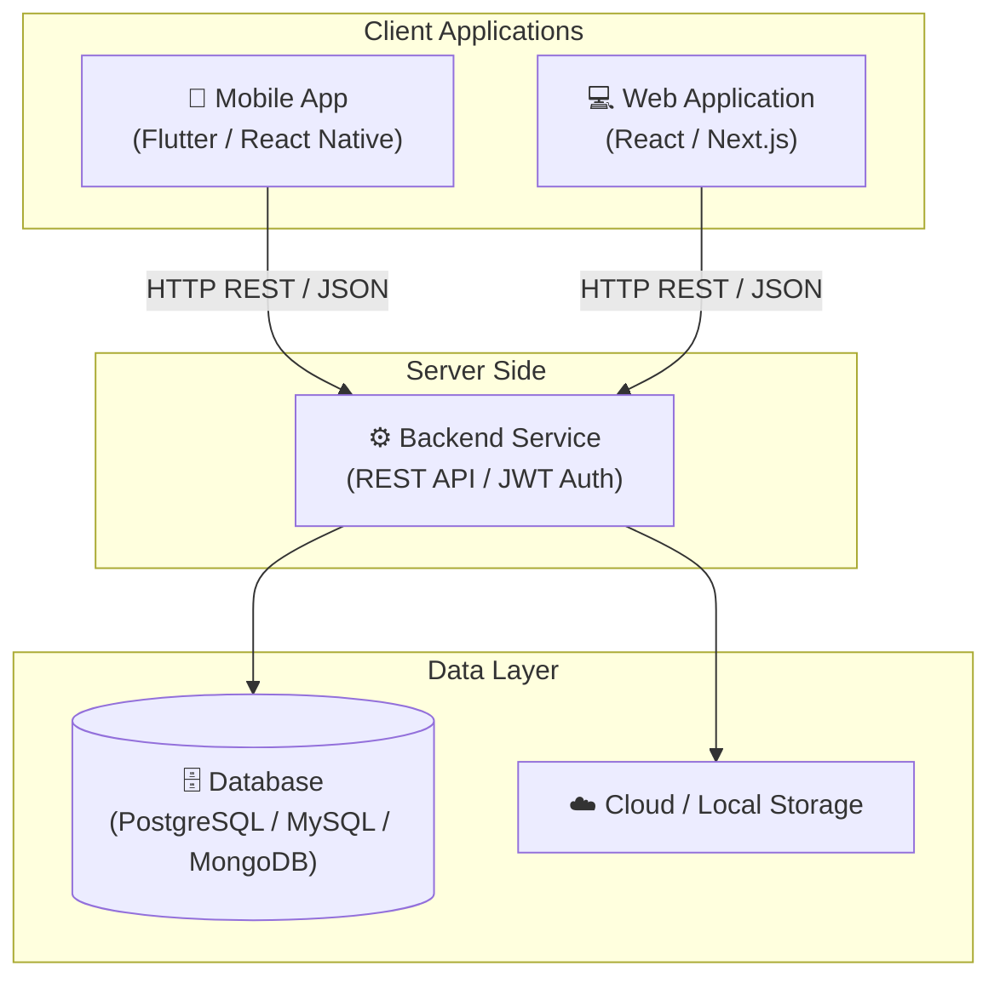

# PRM - Project Architecture & Source Code

> **Hệ thống PRM (Project Repository)**  
> Kho chứa mã nguồn tích hợp bao gồm 3 phân hệ chính: **Backend**, **Mobile App**, và **Web Application**.

---

## 📂 1. Cấu trúc tổng thể Repository

```text
code/
├── backend/       # Mã nguồn Server & RESTful API Service
│   └── README.md  # Chi tiết kiến trúc và hướng dẫn chạy Backend
├── mobile/        # Mã nguồn ứng dụng di động (Flutter / React Native)
│   └── README.md  # Chi tiết giao diện và hướng dẫn chạy Mobile
├── web/           # Mã nguồn ứng dụng web / Admin Portal (React / Next.js)
│   └── README.md  # Chi tiết tính năng và hướng dẫn chạy Web
└── README.md      # Tài liệu tổng quan toàn bộ dự án
```

---

## 🏛️ 2. Mô hình kiến trúc hệ thống



---

## 🚀 3. Hướng dẫn bắt đầu nhanh (Quick Start)

Mỗi phân hệ có tài liệu hướng dẫn và cấu hình độc lập:

1. **Khởi chạy Backend trước**:
   - Truy cập vào thư mục [`backend/`](./backend/README.md).
   - Xem hướng dẫn chi tiết tại [backend/README.md](./backend/README.md).
   - Khởi động cơ sở dữ liệu và start API server.

2. **Khởi chạy Web**:
   - Truy cập vào thư mục [`web/`](./web/README.md).
   - Xem hướng dẫn chi tiết tại [web/README.md](./web/README.md).
   - Cấu hình URL trỏ về Backend API và chạy dev server.

3. **Khởi chạy Mobile**:
   - Truy cập vào thư mục [`mobile/`](./mobile/README.md).
   - Xem hướng dẫn chi tiết tại [mobile/README.md](./mobile/README.md).
   - Mở Emulator / Simulator và chạy ứng dụng.

---

## 🌿 4. Quy tắc quản lý Git & Nhánh (Branching Strategy)

- `main` / `master`: Nhánh mã nguồn ổn định, đã kiểm thử để triển khai.
- `develop`: Nhánh tích hợp tính năng chung trước khi phát hành.
- `feature/<tên-tính-năng>`: Nhánh làm tính năng mới (ví dụ: `feature/auth-login`, `feature/payment-vnpay`).
- `bugfix/<tên-lỗi>`: Nhánh sửa lỗi phát sinh.
